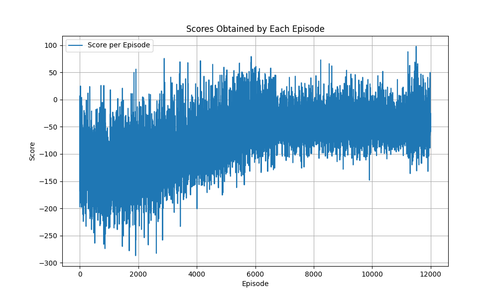

# AI Yahtzee
 Echipa: Morărașu Cătălin B4, Savin Ionuț B4 Vasilică, Alexandru B4
 
## Funcționalități

- Implementarea regulilor jocului Yahtzee
- Modelarea stărilor și a acțiunilor posibile
- Implementarea unui agent antrenat prin Q-learning folosind o rețea neurală și un environment implementat de noi
- Implementarea unei strategii MinMax cu Alpha-Beta Pruning pentru a optimiza jocul
- Interfață grafică pentru joc ce permite slecția și aruncarea zarurilor, selectarea categoriilor și afișarea scorului celor doi jucători
- Posibiliatea de a pune întrebări despre regulile jocului unui asistent prin intermediul API-ului gratuit Gemini Ai
- Posibilitatea de a cere sugestii și de a primi feedback de la agentul antrenat
- Posibilitatea de a selecta strategia competitorului (MinMax sau Q-learning)
- Înregistrarea rezultatelor obținute și posibiliatea de a vedea istoricul jocurilor printr-o bază de date Sqlite

O comparație a performanțelor celor două strategii poate fi observată în fișierul `strategies.md`
Un grafic al evoluției reward-ului obținut de  agentul Q-learning:

## Cum se rulează

1. Se clonează repository-ul și se accesează directorul proiectului
2. Se instalează dependențele folosind comanda `pip install -r requirements.txt`
3. Se creează un fișier `.env` în care se adaugă cheia de acces la Gemini Ai și se adaugă cheia de API Gemini care poate fi obținută [aici](https://aistudio.google.com/app/apikey)
4. Se rulează aplicația folosind comanda `python main.py`